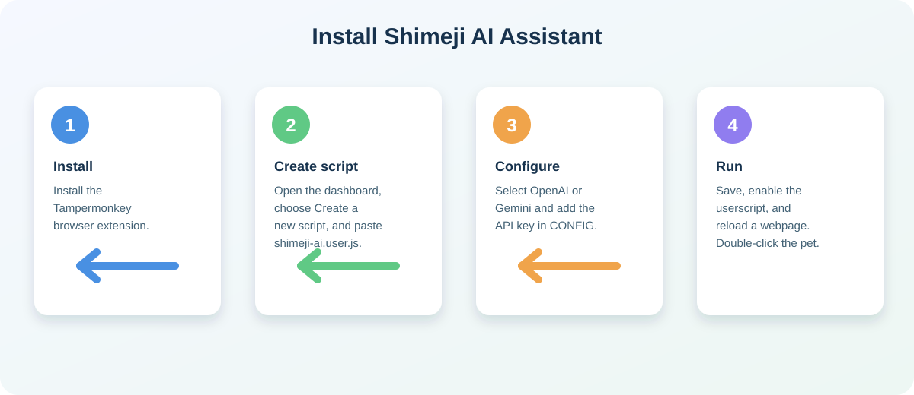

# Shimeji AI Assistant

Shimeji AI Assistant is a Tampermonkey userscript that adds an interactive floating mascot to webpages. The character can walk, jump, fall, climb, react to visible HTML elements, be dragged with the mouse, and answer questions through an OpenAI or Google Gemini API.

The project uses plain JavaScript and browser APIs. It has no npm dependency and no build step.

## Installation At A Glance



The diagram summarizes the setup. Follow the detailed steps below when installing the script for the first time.

## Features

- Floating Shimeji-style character rendered inside an isolated Shadow DOM.
- Embedded SVG base64 sprites for idle, walking, jumping, falling, climbing, and dragging states.
- Time-based sprite animation that remains stable across different refresh rates.
- Gravity, friction, speed limits, landing detection, edge turning, and climbing behavior.
- Intelligent platform detection based on visible webpage elements.
- Automatic platform rescanning so dynamic pages can update their layout.
- Mouse dragging with release-to-fall behavior.
- Double-click chat interaction.
- Chatbox that stays within the visible viewport.
- Chatbox close button, `Escape` key support, and automatic timeout closing.
- OpenAI and Google Gemini support through `GM_xmlhttpRequest`.
- Graceful handling for missing API keys, HTTP errors, network failures, and request timeouts.
- Obstacle detection, stuck recovery, controlled descending, and refresh-rate-independent movement.

## Project Files

- `shimeji-ai.user.js` - the complete Tampermonkey userscript.
- `README.md` - this installation and usage guide.

## Requirements

- A Chromium-based browser, Firefox, or another browser supported by Tampermonkey.
- The Tampermonkey browser extension.
- An OpenAI API key or Google Gemini API key if AI chat is required.
- Internet access for AI requests only. Character sprites are embedded locally as base64 data.

## Installation

1. Install [Tampermonkey](https://www.tampermonkey.net/) in your browser.
2. Open the Tampermonkey dashboard.
3. Select **Create a new script**.
4. Open `shimeji-ai.user.js` from this project.
5. Copy the complete file contents into the new Tampermonkey editor.
6. Configure an AI provider and API key as described below.
7. Save the script with `Ctrl+S`.
8. Enable the userscript in the Tampermonkey dashboard.
9. Open or reload a webpage matching the userscript metadata.

The script uses `@match *://*/*`, so it is enabled on HTTP and HTTPS webpages. To limit it to specific websites, replace that metadata line with a narrower match pattern, for example:

```javascript
// @match        https://example.com/*
```

## AI Configuration

Configuration is located near the top of `shimeji-ai.user.js` inside the `CONFIG` object.

### OpenAI

```javascript
AI_PROVIDER: 'openai',
API_KEY: 'YOUR_OPENAI_API_KEY',
MODEL: 'gpt-4o-mini',
```

The OpenAI endpoint is configured through:

```javascript
OPENAI_API_URL: 'https://api.openai.com/v1/chat/completions',
```

### Google Gemini

```javascript
AI_PROVIDER: 'gemini',
GEMINI_API_KEY: 'YOUR_GEMINI_API_KEY',
```

The Gemini endpoint is configured through `GEMINI_API_URL`.

Only configure one provider at a time. Placeholder values are detected automatically, and the chat will display a setup message instead of sending an invalid request.

## Character Configuration

The following values control movement and interaction:

```javascript
GRAVITY: 0.8,
FRICTION: 0.86,
MAX_SPEED: 9,
CHARACTER_SIZE: 80,
PLATFORM_MARGIN: 16,
QUESTION_PAUSE_MS: 5000,
MAX_PROMPT_LENGTH: 2000,
API_TIMEOUT_MS: 30000,
MAX_FRAME_DELTA_MS: 50,
PLATFORM_SCAN_INTERVAL_MS: 500,
ANSWER_ANIMATION_MS: 1800,
MAX_CHAT_MESSAGES: 100,
MAX_RESPONSE_LENGTH: 12000,
ENABLE_DESCENDING: true,
DESCENDING_CHANCE: 0.18,
DESCENDING_DURATION_MS: 260,
STUCK_TIMEOUT_MS: 1100,
RECOVERY_COOLDOWN_MS: 1200,
SPRITE_SCALE: 1.08,
```

- `GRAVITY` controls downward acceleration.
- `FRICTION` controls how quickly horizontal movement slows down.
- `MAX_SPEED` limits horizontal velocity.
- `CHARACTER_SIZE` sets the character width and height in pixels.
- `PLATFORM_MARGIN` controls how close the character must be to a vertical edge to climb.
- `QUESTION_PAUSE_MS` controls how long the character waits after opening chat.
- `MAX_PROMPT_LENGTH` prevents excessively large prompts.
- `API_TIMEOUT_MS` prevents a request from hanging indefinitely.
- `MAX_FRAME_DELTA_MS` prevents large physics jumps after a background tab becomes active again.
- `PLATFORM_SCAN_INTERVAL_MS` controls how often webpage platforms are rescanned.
- `ANSWER_ANIMATION_MS` controls the speaking animation after an AI response.
- `MAX_CHAT_MESSAGES` bounds the number of visible chat messages kept in the DOM.
- `MAX_RESPONSE_LENGTH` rejects excessively large API responses.
- `ENABLE_DESCENDING` enables controlled drop-through movement.
- `DESCENDING_CHANCE` controls how often the character chooses to descend.
- `DESCENDING_DURATION_MS` controls the drop-through duration.
- `STUCK_TIMEOUT_MS` controls how long the character may remain without progress before recovery.
- `RECOVERY_COOLDOWN_MS` prevents repeated jump or turn recovery at the same position.
- `SPRITE_SCALE` adjusts the visual size of the embedded sprite inside the character box.

## Sprite Customization

Sprites are stored as base64 SVG data URIs in the configuration:

```javascript
SPRITE_IDLE: 'data:image/svg+xml;base64,...',
SPRITE_DRAG: 'data:image/svg+xml;base64,...',
SPRITE_CLIMB: 'data:image/svg+xml;base64,...',
SPRITE_JUMP: 'data:image/svg+xml;base64,...',
```

To use your own artwork:

1. Prepare transparent PNG, SVG, or another browser-supported image.
2. Convert it to a data URI, or encode SVG text as base64.
3. Replace the corresponding `SPRITE_*` value.
4. Keep the artwork square when possible so it aligns with the `CHARACTER_SIZE` box.

Walking uses a frame list in `CharacterPhysics`. Replace the entries in the `walking.urls` array with your own local data URIs to create a custom walk cycle.

### Sprite Size Guidelines

- Recommended source size: `100x100` or `128x128` pixels.
- Minimum source size: `32x32` pixels.
- Practical maximum: `512x512` pixels per frame.
- Use a square `1:1` canvas with transparency.
- Keep raster data below approximately `200 KB` per frame.
- For SVG, use a consistent `viewBox`, such as `0 0 100 100`.
- Leave approximately `4-8 px` of transparent margin around the artwork.
- The default render box is `80x80` pixels through `CHARACTER_SIZE`.

The renderer applies a small visual overscan to reduce excessive transparent padding. Do not place important artwork at the extreme edge of the source image, or the pose may be clipped.

## How to Use

### Open the chat

Double-click the character. The character pauses briefly and the chat panel opens near it.

### Ask a question

Type a question into the input field and press **Enter**, or click the arrow button.

The input is limited to the configured `MAX_PROMPT_LENGTH` value. Only one request is processed at a time.

### Close the chat

Use any of these methods:

- Click the `×` button in the chat header.
- Press `Escape` while the input is focused.
- Wait until the conversation pause timeout expires.

Closing the chat does not delete the conversation history stored in the current page session.

### Move the character

- Click and hold the character to drag it.
- Release the mouse to let it fall naturally.
- The character automatically walks, jumps, turns at platform edges, and may climb suitable webpage elements.

## How Platform Detection Works

The physics engine scans visible HTML elements and selects meaningful layout blocks such as sections, articles, navigation areas, lists, tables, forms, and other block-like elements.

The following elements are excluded from platform detection:

- Scripts and styles.
- Iframes, SVG, and canvas elements.
- Images, video, and audio.
- Inputs and buttons.
- The Shimeji Shadow DOM host itself.

Platform geometry is refreshed periodically so the character can respond to dynamic layouts. Very large pages may require increasing `PLATFORM_SCAN_INTERVAL_MS` to reduce CPU usage.

## Security Notes

Do not publish a real API key inside a public userscript repository. A key stored in a browser userscript can be inspected by the user, browser extensions, or webpage tooling.

For production use, the safer architecture is:

1. Store the API key on a server-side proxy.
2. Send the user prompt from the userscript to your own backend.
3. Let the backend call OpenAI or Gemini.
4. Apply authentication, rate limiting, request validation, and usage limits on the backend.

The userscript currently declares these Tampermonkey permissions:

```text
GM_xmlhttpRequest
GM_addStyle
```

It also declares network access for:

```text
api.openai.com
generativelanguage.googleapis.com
```

Review these permissions before installing the script on sensitive browsing profiles.

## Troubleshooting

### The character does not appear

- Confirm the userscript is enabled in Tampermonkey.
- Reload the webpage after saving the script.
- Check that the page uses `http://` or `https://`.
- Open the browser developer console and look for userscript errors.

### The chat says the API key is not configured

- Confirm `AI_PROVIDER` matches the key you configured.
- Replace the placeholder key with a valid key.
- Save the script and reload the webpage.

### The API request fails

- Check the API key and provider quota.
- Confirm the provider endpoint and model are valid.
- Check that the required `@connect` permission exists.
- Check the browser console and network connection.

### The character uses too much CPU

- Increase `PLATFORM_SCAN_INTERVAL_MS`, for example from `500` to `1000`.
- Reduce `CHARACTER_SIZE` if the page contains many small elements.
- Restrict `@match` to the websites where the assistant is needed.

### The chat is partly outside the screen

The script automatically clamps the panel to the viewport. Resize or reload the page if another browser extension changes the viewport after the panel opens.

## Development Validation

Run the following command from the project directory to validate JavaScript syntax:

```powershell
node --check shimeji-ai.user.js
```

No build command is required. This project is intended to run directly as a Tampermonkey userscript.
